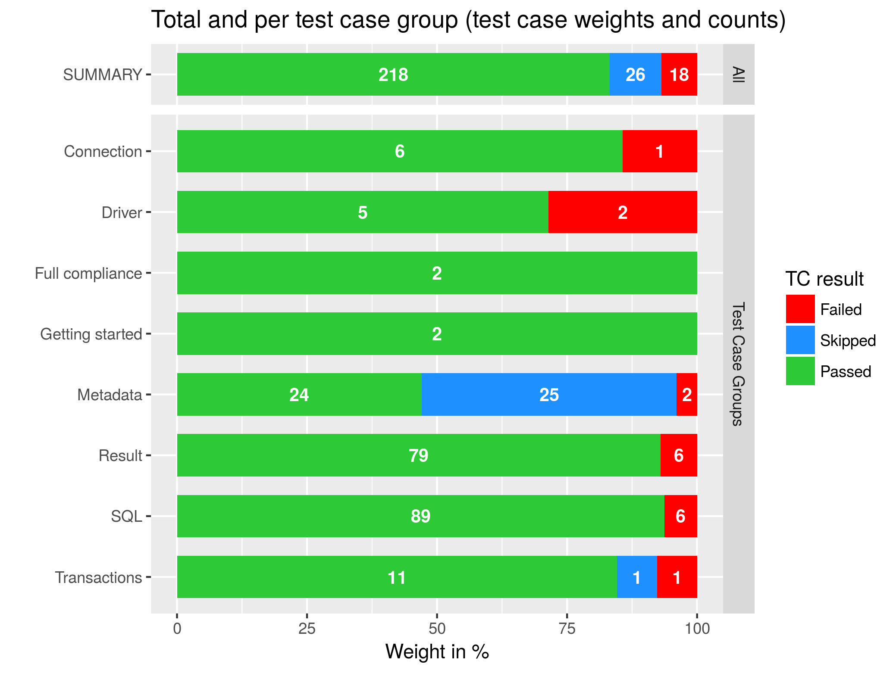

# Compliance maturity reports for different databases accessed with R using the DBI interface

## Scope

This repository is intended as

* a collection of reports
* that compare how good different databases support DBI-based data access
* using the [programming language R][1].

The DBI compliance is checked by applying the unit tests of the package [`DBItest`][3].

The source code to generate the reports is also included.

## Example reports

**For a first example of a result report see this [real-life report](https://htmlpreview.github.io/?https://github.com/aryoda/R_DBI_DB_conformity_reports/blob/master/results/examples/example_result_report.html)
and [the correspondig raw data](results/examples/example_result_raw_data.xlsx) (still based on [SQLite](https://www.sqlite.org/)).**

### Example summary: Database xy

This diagram shows the comliance maturity of a database xy (total and per test case group):

## `DBI` is...

*"... a common interface between R/S and RDBMS that would allow users to access data stored on database servers in a uniform and predictable manner irrespective of the database engine. The interface defines a small set of classes and methods similar in spirit to Python’s DB-API, Java’s JDBC, Microsoft’s ODBC, Perl’s DBI, etc."*

Source: https://cran.r-project.org/web/packages/DBI/vignettes/DBI-proposal.html

You can find the full DBI specification at CRAN: https://cran.r-project.org/web/packages/DBI/vignettes/spec.html

**Just remember: DBI is a common database interface to access different databases via the same API.**

## Use cases of the reports

1. Decide if a DBI driver covers the requirements of a project for a specific database
1. Compare the working features of different drivers for the same database (e. g. `odbc` vs. `RPostgreSQL` packages)
1. Help developers of DBI drivers to find gaps and improve their drivers toward full DBI-conformity
1. Help database vendors (their developers) to close gaps in the database engines required to be DBI-conform
   (e. g. for new big-data or noSQL databases)

## Current status

Last status update: Feb 10, 2018

The work is still in progress based on the embedded database SQLite on Linux
for easier development without a DB server (see [TODO list](TODO.md))...

For a list of currently supported test configurations (database/driver combinations)
see the test configuration file:

https://github.com/aryoda/R_DBI_DB_conformity_reports/blob/master/R/test_configs.R

My (personal) goal is the check the Microsoft SQL Server 2017 using the DBI-ODBC "bridge"
provided by the [`odbc`][2] package to identify more open issues to be solved in the `odbc` package
(or the SQL server).

## How to run the tests

1. Clone or download the repository
1. Install the database drivers (native, ODBC...) on the client computer
1. Install docker
1. Prepare the required docker container by using the `install*` scripts in the sub folder `docker`
1. Adjust the test configuration file
   [test_configs.xlsx](https://github.com/aryoda/R_DBI_DB_conformity_reports/blob/master/test_configs.xlsx)
   using LibreOffice Calc or Excel
1. Run the tests by executing (sourcing) `main.R`

## I have a dream...

... to provide **a central DBI-conformity database** that

1. is showing the DBI-conformity status of all database/DBI-driver/client-OS combinations
1. is updated whenever a new version of a database is released
1. is updated whenever a new version of DBI-driver is published (e. g. via *continuous integration* with [docker][4])
1. is finally showing 100 % DBI-conformity for all database/DBI-driver/client-OS combinations ;-)

OK, to be realistic: I can't do this alone - so please contribute if you want the dream to become true!

## References

1. [Programming language R](https://www.r-project.org/)
1. [DBI package for R: Declares the formal DBI interface](https://github.com/r-dbi/DBI)
1. [DBItest package for R: Contains unit tests to check DBI conformity](https://github.com/r-dbi/DBItest)
1. [odbc package for R: DBI-based driver to use the ODBC interface for database access](https://github.com/r-dbi/odbc)
1. [Docker containerization platform](https://www.docker.com/)
1. [Connection string syntax and examples for many database vendors](https://www.connectionstrings.com)
1. [R driver packages that implement the DBI interface (see *Reverse depends*)](https://cran.r-project.org/web/packages/DBI/index.html)
1. [DBI documentation from RStudio (containing a short history too)](https://db.rstudio.com/dbi/)

[1]: https://www.r-project.org/
[2]: https://github.com/r-dbi/odbc
[3]: https://github.com/r-dbi/DBItest
[4]: https://www.docker.com/

